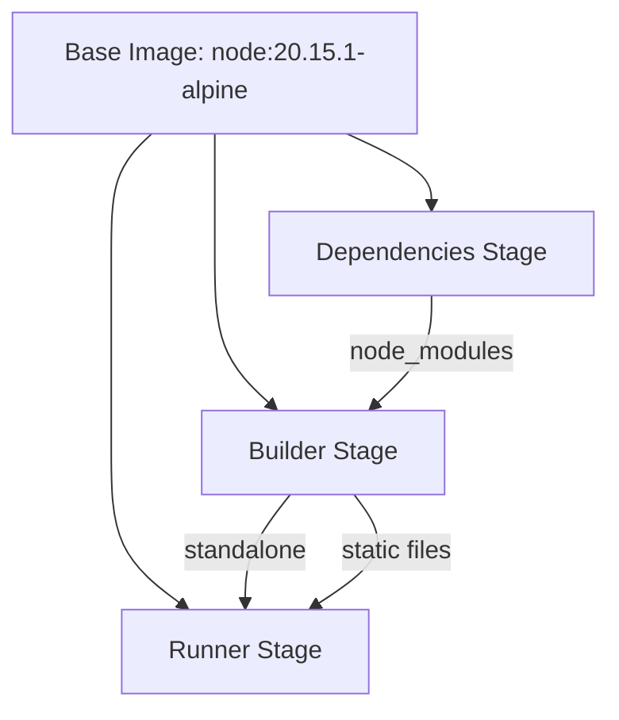
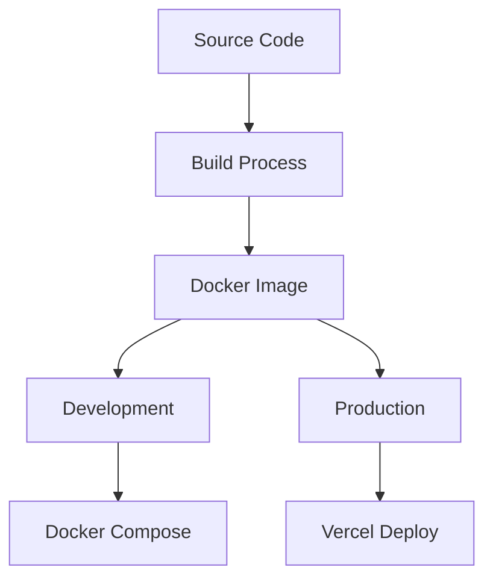

# System Patterns

## Architecture Overview

### Directory Structure
```
app/                    # Next.js app directory
├── [locale]/           # Internationalization routes
│   ├── (private)/     # Protected routes
│   └── (public)/      # Public routes
├── api/               # API routes
└── auth/              # Authentication endpoints

components/            # React components
├── custom/           # Project-specific components
└── ui/               # Reusable UI components

configs/              # Configuration files
├── i18n/            # Internationalization setup
├── messages/        # Translation files
├── prisma/          # Database configuration
└── supabase/        # Supabase integration

constants/           # Shared constants
hooks/              # Custom React hooks
lib/               # Utility libraries
types/             # TypeScript definitions
utils/             # Helper functions
```

## Technical Decisions

### 1. Routing Architecture
- Next.js App Router for file-based routing
- Route groups for organizing public/private sections
- Dynamic [locale] routing for internationalization
- Middleware for authentication and locale handling

### 2. Component Architecture
- Separation of UI and custom components
- Client/Server component separation
- Component composition patterns
- Prop typing with TypeScript

### 3. Data Management
- Prisma for type-safe database operations
- Supabase for authentication and real-time features
- Server-side data fetching patterns
- Client-side state management

### 4. Styling Strategy
- TailwindCSS for utility-first styling
- Shadcn/UI for consistent component design
- CSS modules for component-specific styles
- Theme system for light/dark mode

### 5. Docker Architecture


#### Multi-stage Build Process
1. Dependencies Stage (deps)
   - Install system dependencies
   - Install npm packages
   - Generate Prisma client

2. Builder Stage
   - Copy node_modules
   - Build application
   - Generate standalone output

3. Runner Stage
   - Production-optimized
   - Security hardened
   - Minimal footprint

#### Container Security
- Non-root user (nextjs)
- System group (nodejs)
- Minimal base image
- Production environment

## Design Patterns

### 1. Component Patterns
```typescript
// Page Layout Pattern
<BaseLayout>
  <PageLayout>
    <Header />
    {children}
    <Footer />
  </PageLayout>
</BaseLayout>

// Component Composition
<ThemeProvider>
  <ToastProvider>
    <Component />
  </ToastProvider>
</ThemeProvider>
```

### 2. Error Handling Pattern

#### Client-Side Error Handling
```typescript
// useHandleError Hook Pattern
const { handleErrorClient } = useHandleError();

await handleErrorClient({
  cb: async () => { /* async operation */ },
  onSuccess: ({ data }) => { /* success handler */ },
  withSuccessNotify: true
});
```

#### Server-Side Error Handling
```typescript
// Public Routes
const response = await handleErrorServerNoAuth({
  cb: async () => { /* server operation */ }
});

// Protected Routes
const response = await handleErrorServerWithAuth({
  cb: async ({ user }) => { /* authenticated operation */ }
});
```

#### Response Types
```typescript
type ResponseType<T = any> = {
  error?: ErrorResponseType;
  data?: T;
};

type ErrorResponseType = {
  message: string;
};
```

#### Error Boundaries
```typescript
// Global Error Boundary
app/error.tsx
app/[locale]/error.tsx

// Component Error Boundaries
components/custom/ErrorBoundary.tsx
```

### 2.1 Testing Patterns

#### Unit Testing
```typescript
// Component Tests
describe('Component', () => {
  it('handles errors correctly', async () => {
    const { handleErrorClient } = useHandleError();
    await handleErrorClient({
      cb: mockAsyncOperation,
      onSuccess: mockSuccessHandler
    });
  });
});

// API Route Tests
describe('API Route', () => {
  it('handles unauthorized access', async () => {
    const response = await handleErrorServerWithAuth({
      cb: mockProtectedOperation
    });
    expect(response.error).toBeDefined();
  });
});
```

#### Integration Testing
```typescript
// Auth Flow Testing
describe('Authentication', () => {
  it('protects routes correctly', async () => {
    // Test middleware
    // Test session handling
    // Test callback routes
  });
});

// API Integration
describe('API Integration', () => {
  it('handles complete workflows', async () => {
    // Test data flow
    // Test error scenarios
    // Test success paths
  });
});
```

### 3. Authentication Pattern
```typescript
// Auth Flow
app/api/auth/callback/route.ts
configs/supabase/middleware.ts
```

### 4. Internationalization Pattern
```typescript
// i18n Configuration
configs/i18n/routing.ts
configs/i18n/request.ts
```

### 5. Deployment Pattern


## Component Relationships

### 1. Layout Hierarchy
```
BaseLayout
└── PageLayout
    ├── Header
    │   ├── LocalSelect
    │   ├── ModeToggle
    │   └── UserProfile
    └── Footer
```

### 2. Provider Hierarchy
```
ThemeProvider
└── Component Tree
    ├── UI Components
    └── Custom Components
```

### 3. Data Flow
```
API Routes → Server Components → Client Components
Supabase ←→ Authentication Flow
Prisma ←→ Database Operations
```

## Implementation Guidelines

### 1. Component Creation
- Use TypeScript for all components
- Separate client/server concerns
- Implement proper error boundaries
- Follow accessibility guidelines

### 2. State Management
- Use server components where possible
- Implement proper loading states
- Handle errors gracefully
- Type all data structures

### 3. Routing Implementation
- Group related routes
- Implement proper middleware
- Handle dynamic routes
- Manage redirects

### 4. API Development
- Type-safe endpoints
- Proper error handling
- Request validation
- Response formatting

### 5. Docker Development
- Use multi-stage builds
- Optimize layer caching
- Implement security best practices
- Manage environment variables

### 6. Deployment Strategy
1. Development
   - Docker Compose for local development
   - Hot reloading enabled
   - Development-specific configurations

2. Production
   - Vercel deployment
   - Docker container deployment
   - Environment variable management
   - Production optimizations

These patterns form the foundation of the system architecture and should be followed for consistency and maintainability.